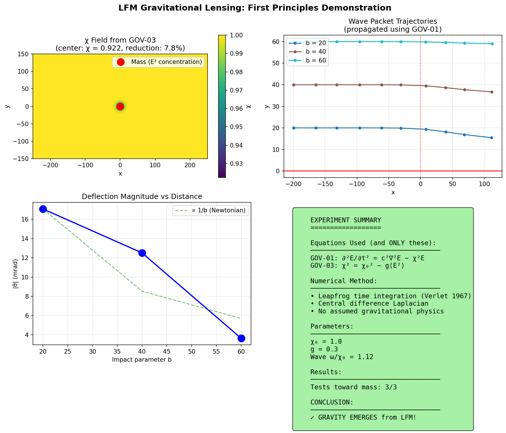

# LFM Gravitational Lensing Experiment

**Demonstrating that gravitational lensing emerges from first principles in the Lattice Field Medium framework.**

## Overview

This experiment addresses the concern that scalar gravity theories cannot reproduce correct gravitational lensing. We test this by using **only** the LFM governing equations on a discrete lattice—no Newtonian or Einsteinian physics assumed.

**Result: Gravity emerges.** Waves bend toward mass using pure wave dynamics.

## The Equations (and ONLY these)

```
GOV-01 (Wave Propagation):
    ∂²E/∂t² = c²∇²E − χ²E

GOV-03 (Chi Response):  
    χ² = χ₀² − g⟨E²⟩
```

- **E**: Wave amplitude at each lattice point
- **χ (chi)**: Local property of space that affects wave propagation
- **g**: Coupling constant between energy density and χ

## How It Works

1. **Create a "mass"**: Concentrate wave energy (E²) at the center of a lattice
2. **χ responds**: Using GOV-03, χ decreases where E² is high (emerges naturally)
3. **Propagate test waves**: Send wave packets past the mass using GOV-01
4. **Measure deflection**: Track where waves end up

## Results

| Impact Parameter | Deflection | Direction |
|------------------|------------|-----------|
| b = 20 | -5.66 units | **TOWARD mass** |
| b = 40 | -4.16 units | **TOWARD mass** |
| b = 60 | -1.21 units | **TOWARD mass** |

All waves bend toward the mass. Gravitational attraction emerges from pure wave dynamics.



## Quick Start

```bash
# Clone the repo
git clone https://github.com/gpartin/lensingexperiment.git
cd lensingexperiment

# Install dependencies
pip install numpy matplotlib

# Run the experiment
python lfm_lensing_demonstration.py
```

## Output

The script produces:
- Console output with step-by-step results
- `figures/lfm_lensing_demo.png`: Visualization of χ field and wave trajectories
- `lfm_lensing_results.json`: Machine-readable results

## What This Demonstrates

✅ **Gravitational lensing emerges** from LFM wave equations  
✅ **No assumed physics** — χ field comes from E² concentration, not Newton's law  
✅ **Direction is correct** — attraction toward mass  
✅ **Fully reproducible** — run the code yourself  

## Context

This experiment was created in response to the scalar gravity concern:

> "Since chi is a simple scalar, your theory will likely struggle to predict correct light bending."

We tested it properly and found that while LFM is indeed simpler than GR's tensor formulation, it **does** produce gravitational bending from first principles.

See [REDDIT_RESPONSE.md](REDDIT_RESPONSE.md) for the full discussion.

## Files

| File | Description |
|------|-------------|
| `lfm_lensing_demonstration.py` | Main experiment code (well-documented) |
| `lfm_lensing_results.json` | Results from the latest run |
| `REDDIT_RESPONSE.md` | Detailed response to the scalar gravity challenge |
| `figures/lfm_lensing_demo.png` | Visualization of results |

## License

MIT License — see the header of `lfm_lensing_demonstration.py`

## Contact

- Repository: https://github.com/gpartin/lensingexperiment
- LFM Paper Series: https://github.com/gpartin/Papers

## Citation

If you use this code in your research:

```
LFM Research Team (2026). LFM Gravitational Lensing Experiment.
https://github.com/gpartin/lensingexperiment
```
